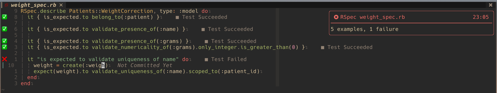
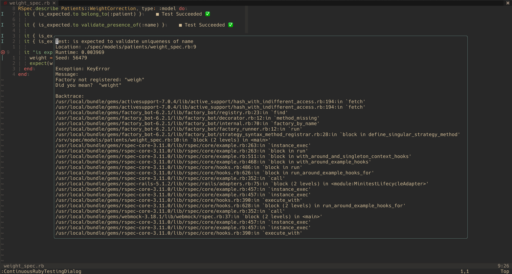
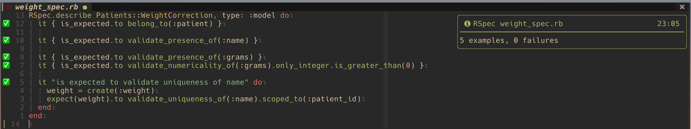

# continuous-testing.nvim

## Description

Run tests async on save, add to diagnostics, get notified on failures.

### Screenshots





## Installation

### Packer

```lua
return require('packer').startup(function(use)
    use 'aaronhallaert/continuous-testing.nvim'
end)
```

### Dependencies

- [nvim-notify](https://github.com/rcarriga/nvim-notify)

### Config

```lua
-- %file will be replace with the test file
require("continuous-testing").setup {
    test_command = {
        ruby_rspec = "bundle exec spring rspec %file --format json --no-fail-fast"
    }
}
```

## Usage

| Command                       | Usage                              | Behaviour                                     |
| ----------------------------- | ---------------------------------- | --------------------------------------------- |
| ContinuousRubyTesting         | When current buffer is a test file | Add current buffer to start tests on save     |
| ContinuousRubyTestingDialog   | On line of failure                 | Show output of failed test in floating window |
| ContinuousRubyTestingFailures | \*                                 | Add test failures to quickfix list            |

## TODO

- [ ] Create default test command for a language
- [ ] Ability to override test command based on project (folder)
- [ ] Add different languages (change to general command `ContinuousTesting` instead of `ContinuousRubyTesting`)
- [x] Add branch protection to github project
- [x] Add github actions: linters, tests
