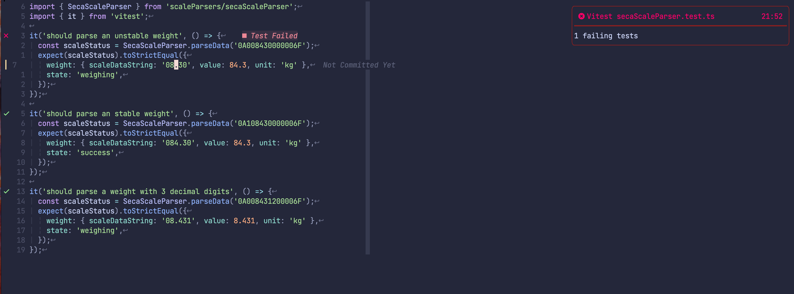
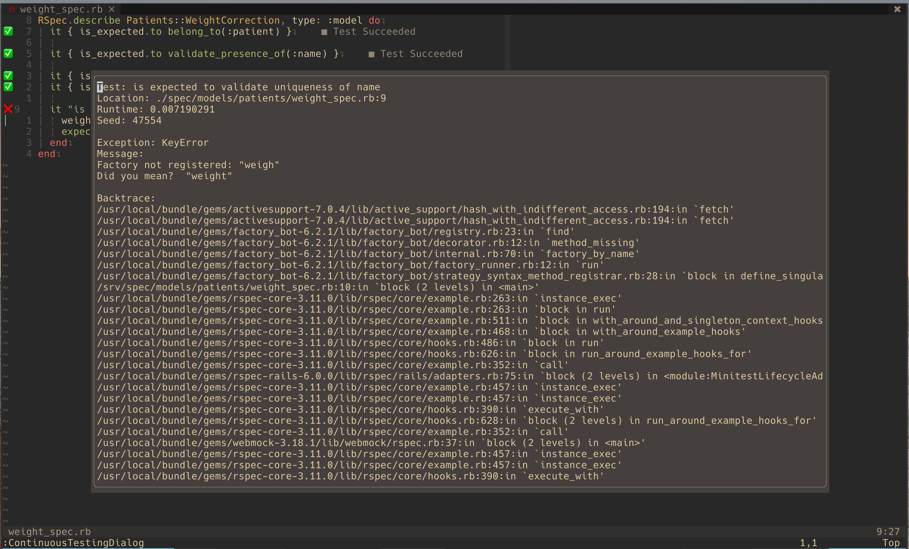
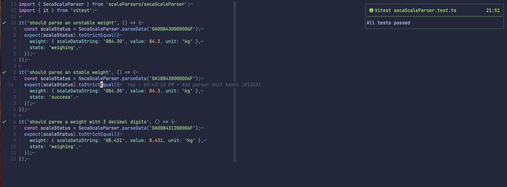

# continuous-testing.nvim

## Description

Run tests async on save, add to diagnostics, get notified on failures.

Inspired by [teejdv - Integrated Test Results](https://www.youtube.com/watch?v=cf72gMBrsI0).

### Screenshots





## Installation

### Packer

```lua
return require('packer').startup(function(use)
    use 'aaronhallaert/continuous-testing.nvim'
end)
```

### Dependencies

- [nvim-notify](https://github.com/rcarriga/nvim-notify)

### Config

```lua
-- %file will be replace with the test file
require("continuous-testing").setup {
    notify = true, -- The default is false
    framework_setup = {
        ruby = {
            test_tool = "rspec",
            test_cmd = "bundle exec rspec %file --format json --no-fail-fast",
        }
    },
    project_override = {
        ["/Users/name/Developer/ruby-project"] = {
            ruby = {
                test_tool = "rspec",
                test_cmd = "docker exec -it name -- bundle exec rspec %file --format json --no-fail-fast",
            },
        },
    },
}
```

### Supported Test Frameworks

| Language | Frameworks | Required Options |
| -------- | ---------- | ---------------- |
| Ruby     | rspec      | `--format json`  |

## Usage

Multiple test files can be attached to the continuous testing plugin.

| Command                 | Usage                                              | Behaviour                                     |
| ----------------------- | -------------------------------------------------- | --------------------------------------------- |
| ContinuousTesting       | When current buffer is a test file                 | Add current buffer to start tests on save     |
| ContinuousTestingDialog | On line of failure                                 | Show output of failed test in floating window |
| StopContinuousTesting   | Anywhere in vim when continuous testing is enabled | Stops the continuous testing                  |
| AttachedContinuousTests | Anywhere in vim                                    | List the attached tests in a telescope window |

## TODO

- [x] Create default test command for a language
- [x] Attach tests based on filetype
- [x] Ability to override test command based on project (folder)
- [x] Add different languages (change to general command `ContinuousTesting` instead of `ContinuousRubyTesting`)
- [x] Add branch protection to github project
- [x] Add github actions: linters, tests
