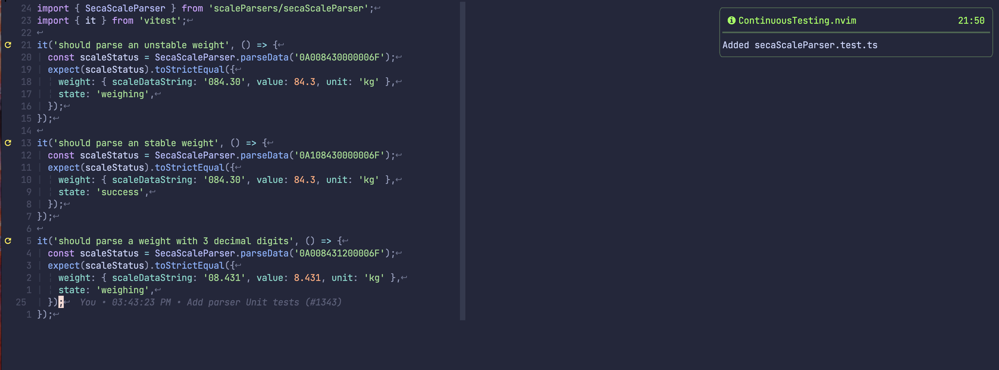

# continuous-testing.nvim

Run tests async on save, add to diagnostics, get notified on failures.

Inspired by [teejdv - Integrated Test Results](https://www.youtube.com/watch?v=cf72gMBrsI0).

## 📝 Description

- Attach a test you want to execute every time you save a file.
- Open a floating window with the output of a failing test.
- Show diagnostics based on test results.
- Show vim-signs based on test results.
- Get notified when the tests are finished.
- Specify your own test command for each project!

### Screenshots

<details>
  <summary>Attach test</summary>
  
  

</details>
<details>
  <summary>Failed test</summary>
  
  

</details>
<details>
  <summary>Passed tests</summary>
  
  

</details>

## ⚙️ Installation

### Plugin manager

- Packer

```lua
return require('packer').startup(function(use)
    use 'aaronhallaert/continuous-testing.nvim'
end)
```

- Lazy.nvim

```lua
{'aaronhallaert/continuous-testing.nvim'}
```

### Dependencies

- [nvim-notify](https://github.com/rcarriga/nvim-notify)
- [nvim-treesitter](https://github.com/nvim-treesitter/nvim-treesitter)
- [telescope.nvim](https://github.com/nvim-telescope/telescope.nvim)

### Config

```lua
-- %file will be replace with the test file
require("continuous-testing").setup {
    notify = true, -- The default is false
    run_tests_on_setup = true, -- The default is true, run test on attach
    framework_setup = {
        ruby = {
            test_tool = "rspec",
            test_cmd = "bundle exec rspec %file",
        },
        javascript = {
            test_tool = "vitest", -- cwd of the executing test will be at package.json
            test_cmd = "yarn vitest run %file",
            root_pattern = "tsconfig.json", -- used to populate the root option of vitest
        },
    },
    project_override = {
        ["/Users/name/Developer/ruby-project"] = {
            ruby = {
                test_tool = "rspec",
                test_cmd = "docker exec -it name -- bundle exec rspec %file",
            },
        },
    },
}
```

### Supported Test Frameworks

#### Rspec (Ruby)

- Make sure rubocop is installed. This is used to check for breakpoints.

#### Vitest (Javascript, Typescript ...)

## 🏋️‍♀️ Usage

Multiple test files can be attached to the continuous testing plugin.

| Command     | Usage                                              | Behaviour                                                                               |
| ----------- | -------------------------------------------------- | --------------------------------------------------------------------------------------- |
| CTAttach    | When current buffer is a test file                 | Add current buffer to start tests on save                                               |
| CTDialog    | On line of failure                                 | Show output of failed test in floating window                                           |
| CTDetach    | Anywhere in vim when continuous testing is enabled | Stops the continuous testing                                                            |
| CTOverview  | Anywhere in vim                                    | List the attached tests in a telescope window                                           |
| CTSingleRun | Anywhere in vim                                    | List the attached test instances in a telescope window press enter to run in a terminal |

## 🛠 Developers

See vim-docs and inline documentation for more info.

### TODO

- [ ] Migrate autocmd filetype triggers to config
